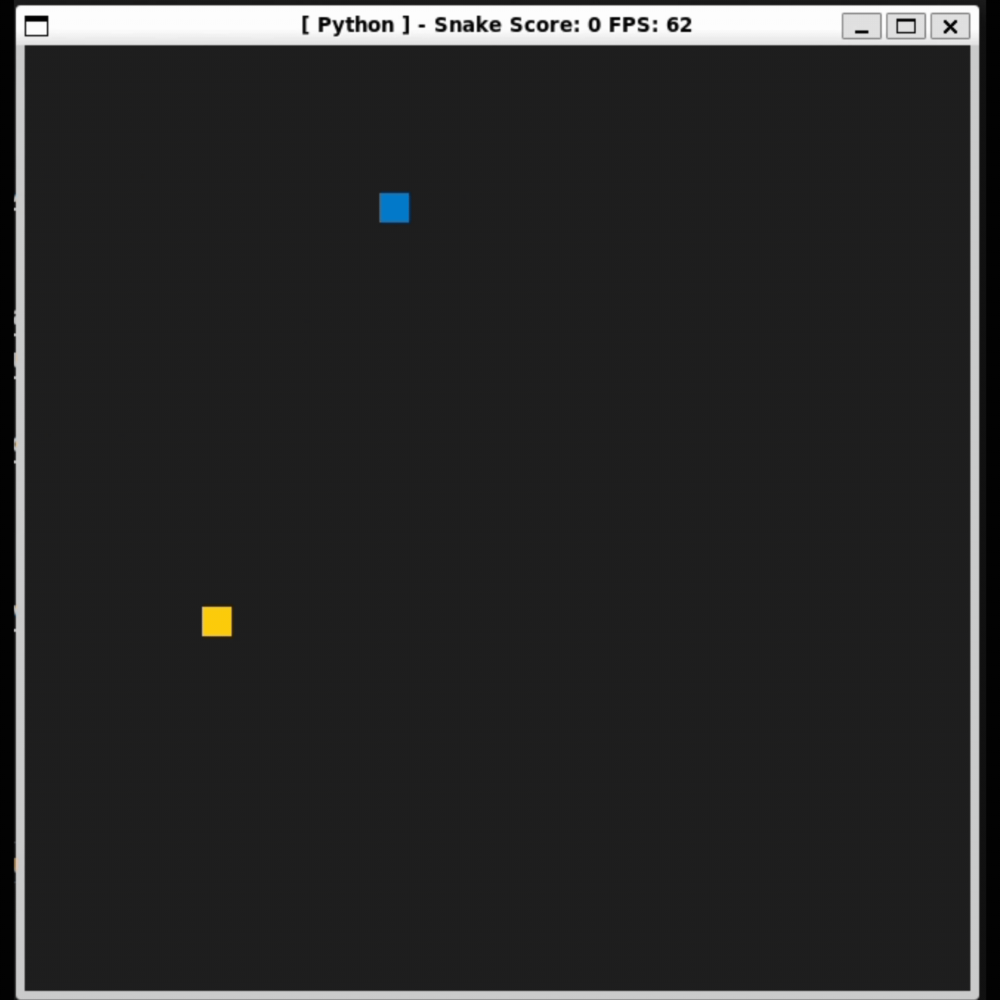

# CPPND: Capstone Snake Game Example

This repo is a fork of the Capstone project in the [Udacity C++ Nanodegree Program](https://www.udacity.com/course/c-plus-plus-nanodegree--nd213). The code for the starter repos was inspired by [this](https://codereview.stackexchange.com/questions/212296/snake-game-in-c-with-sdl) excellent StackOverflow post and set of responses.

In this project, I have extended this Snake game, following the principles I have learned throughout this Nanodegree Program.

## Dependencies for Running Locally (I used Linux)
* cmake >= 3.7
  * All OSes: [click here for installation instructions](https://cmake.org/install/)
* make >= 4.1 (Linux, Mac), 3.81 (Windows)
  * Linux: make is installed by default on most Linux distros
  * Mac: [install Xcode command line tools to get make](https://developer.apple.com/xcode/features/)
  * Windows: [Click here for installation instructions](http://gnuwin32.sourceforge.net/packages/make.htm)
* SDL2 >= 2.0
  * All installation instructions can be found [here](https://wiki.libsdl.org/Installation)
  >Note that for Linux, an `apt` or `apt-get` installation is preferred to building from source. 
* gcc/g++ >= 5.4
  * Linux: gcc / g++ is installed by default on most Linux distros
  * Mac: same deal as make - [install Xcode command line tools](https://developer.apple.com/xcode/features/)
  * Windows: recommend using [MinGW](http://www.mingw.org/)

## Basic Build Instructions

1. Clone this repo.
2. Make a build directory in the top level directory: `mkdir build && cd build`
3. Compile: `cmake .. && make`
4. Run it: `./SnakeGame`.

## New Features added
* Game ends when snake collides with the wall
  * Added in snake.cpp line 46-48
* Players can set their names in console 
* Game window title displays player name, alongwith score, and FPS
* Game history is logged in `build/game_history.txt` after each game session
* Real time game stats are displayed on the console with highest score tracking

## Project Rubric Points
### Loops, Functions, I/O - meet at least 2 criteria
  * The project accepts user input and processes the input.
    * Implemented in `main.cpp lines 8-13` - GetPlayerName function for player name input
  * The project reads data from a file and process the data, and the program writes data to a file.
    * Implemented in `file_game_history.h lines 12-34` - File operations for game history

### Object Oriented Programming - meet at least 3 criteria
  * Classes are organized with attributes to hold data and methods to perform tasks.
    * Implemented in `game_history.h lines 8-23` - Abstract base class with pure virtual methods
    * Implemented in `file_game_history.h lines 8-34` - Concrete class with file handling implementation

  * Classes follow an appropriate inheritance hierarchy with virtual and override functions.
    * Base class: `game_history.h lines 8-23` - GameHistory abstract class with virtual methods
    * Derived class: `file_game_history.h lines 8-34` - FileGameHistory implementing base class interface
    * Virtual functions: `game_history.h lines 12-13` - Pure virtual functions for save and display
    * Override implementation: `file_game_history.h lines 15-31` - Override of virtual functions

  * Classes abstract implementation details from their interfaces.
    * Interface definition: `game_history.h lines 12-13` - Pure virtual interface methods
    * Implementation hiding: `file_game_history.h lines 32-33` - Private member variable
    * Implementation details: `file_game_history.h lines 15-31` - Concrete implementation hidden from users

  * Member data that is subject to an invariant is hidden from the user and accessed via member methods.
    * Protected method: `game_history.h lines 16-22` - Protected formatGameResult method
    * Private data: `file_game_history.h line 33` - Private filename_ member
    * Public interface: `file_game_history.h lines 15-31` - Public methods for data access

### Memory Management - meet at least 3 criteria

1. **At least two variables are defined as references, or two functions use pass-by-reference**
   * Game class uses pass-by-reference in function declarations:
     * `void Run(Controller const &controller, Renderer &renderer, ...)` in `game.h line 17-18`
     * `void SetPlayerName(const std::string& name)` in `game.h line 15`
     * `const GameScore& GetScoreTracker() const` in `game.h line 22`

2. **For all classes, if any one of the copy constructor, copy assignment operator, move constructor, move assignment operator, and destructor are defined, then all of these functions are defined**
   * Snake class implements all five special member functions:
     * Copy constructor: `Snake(const Snake& other)` in `snake.h lines 19-27`
     * Copy assignment: `Snake& operator=(const Snake& other)` in `snake.h lines 32-43`
     * Move constructor: `Snake(Snake&& other) noexcept` in `snake.h lines 47-55`
     * Move assignment: `Snake& operator=(Snake&& other) noexcept` in `snake.h lines 59-71`
     * Default destructor (no manual resource management needed)

3. **The project follows RAII pattern by allocating objects at compile-time, initializing objects when declared, and utilizing scope for automatic destruction**
   * GameScore class follows RAII:
     * Score vector initialized at declaration: `std::vector<ScoreEntry> scores_;` in `game_score.h line 50`
     * ScoreEntry struct with proper member initialization in `game_score.h lines 11-15`
   * Snake class follows RAII:
     * All member variables initialized in constructor list: `snake.h lines 11-15`
     * Vector automatically managed through scope: `std::vector<SDL_Point> body;` in `snake.h line 86`

4. **The project relies on move semantics, instead of copying the object**
   * Snake class implements move semantics for body vector:
     * Move constructor: `body(std::move(other.body))` in `snake.h line 51`
     * Move assignment: `body = std::move(other.body)` in `snake.h line 64`
   * GameScore class uses move semantics:
     * Move constructor: `scores_(std::move(other.scores_))` in `game_score.h line 39`
     * Move assignment: `scores_ = std::move(other.scores_)` in `game_score.h line 44`
     * AddScore method uses move: `scores_.emplace_back(ScoreEntry{std::move(player_name), ...})` in `game_score.h line 22`

### Concurrency - meet at least 2 criteria

1. **The project uses multiple threads or async tasks in the execution**
   * GameStats class implements a separate display thread:
     * Thread creation in constructor: `stats_thread_ = std::thread(&GameStats::DisplayStats, this)` in `game_stats.h line 17`
     * Thread execution in `DisplayStats()` method in `game_stats.h lines 104`
     * Thread cleanup in destructor: `stats_thread_.join()` in `game_stats.h lines 21-25`

2. **A mutex or lock is used to protect shared data across multiple threads**
   * GameStats class uses std::scoped_lock in multiple methods:
     * `UpdateStats()` protects score updates: `std::lock_guard<std::mutex> lock(stats_mutex_)` in `game_stats.h lines 27-32`
     * `SetCurrentPlayer()` protects player name updates: `std::lock_guard<std::mutex> lock(stats_mutex_)` in `game_stats.h lines 39-41`
     * `DisplayStats()` protects stat display: `std::lock_guard<std::mutex> lock(stats_mutex_)` in `game_stats.h line 107`
   * Protected shared members include:
     * `current_score_`, `current_size_`, `current_player_`, `highest_score_`, `highest_score_player_`
     * All access to these members is protected by `stats_mutex_`

## CC Attribution-ShareAlike 4.0 International

Shield: [![CC BY-SA 4.0][cc-by-sa-shield]][cc-by-sa]

This work is licensed under a
[Creative Commons Attribution-ShareAlike 4.0 International License][cc-by-sa].

[![CC BY-SA 4.0][cc-by-sa-image]][cc-by-sa]

[cc-by-sa]: http://creativecommons.org/licenses/by-sa/4.0/
[cc-by-sa-image]: https://licensebuttons.net/l/by-sa/4.0/88x31.png
[cc-by-sa-shield]: https://img.shields.io/badge/License-CC%20BY--SA%204.0-lightgrey.svg
